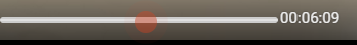

# Just Repeat -- YouTube Video Looper

Just Repeat is a browser extension that allows you to loop specific sections of YouTube videos. It provides a user-friendly interface to mark the start and end times for each loop and automatically plays the video from the start time when the end time is reached.

Check it out on the Chrome Web Store and leave a review
https://chrome.google.com/webstore/detail/just-repeat-looper-for-yo/jmoebgdejlijpadniimglmjbbmpkieno

## How To Use
1. Open a YouTube video in your browser
2. Drag the range slider to select the end time of the loop  
3. Click on the Loop button to create a loop at the Youtube Player current time  
4. The complete icon will appear if the loop was successfully made  
5. The error icon will appear if the loop was unsuccessful  
6. Click on the extension popup to view your loops    
 * The selected loop will be added to the list of loops for the current video in the extension popup
 * To **DELETE** a loop, click on the delete button  next to it in the loops list
 * To **SELECT AND PLAY** a loop, click on the play a button  next to it in the loops list

## Features

- Add loops to YouTube videos by clicking the loop button.
- Specify the start and end times for each loop using an input range slider.
- Loops are saved and can be accessed across different sessions.
- Loop sections are automatically replayed when the end time is reached.
- Remove loops if they are no longer needed.
- Visual feedback using fade text animation.

## Installation

1. Clone the repository or download the source code.
2. Open Google Chrome.
3. Go to the Extensions page by entering `chrome://extensions/` in the address bar.
4. Enable Developer mode using the toggle switch on the top-right corner of the page.
5. Click on "Load unpacked" and select the folder containing the extension files.

## Usage

1. Open YouTube in Google Chrome.
2. Start playing a video.
3. Click on the loop button (white circular icon) to add a new loop.
4. Use the input range slider to adjust the start and end times for the loop.
5. The video will automatically replay from the start time when the end time is reached.
6. To remove a loop, click on the delete button (trash can icon) next to the loop.

## Troubleshooting

If you encounter any issues while using the Just Repeat extension, try the following troubleshooting steps:

- Make sure you have the latest version of the extension installed.
- Restart Google Chrome and try again.
- Disable any conflicting extensions and see if the issue persists.
- Clear your browser cache and cookies.
- If the problem persists, contact our support team at thejustrepeat@gmail.com.

## Known Issues and Limitations

- The extension may not work properly on certain YouTube pages or when using YouTube in fullscreen mode.
- Loop accuracy may vary depending on the video and browser performance.
- The extension is currently available only for Google Chrome.

## Release Notes

### Version 1.0.0
- Initial release of the Just Repeat extension.

### Version 1.0.1
- Added support for YouTube playlists.
- Improved loop playback performance.

## Contributing

Contributions to the Just Repeat project are welcome! If you find any issues or have suggestions for improvements, feel free to open an issue or submit a pull request. Please follow the guidelines in the [CONTRIBUTING.md](https://github.com/colechang/JustRepeat/blob/main/CONTRIBUTING.MD) file.

## License

This project is licensed under the [MIT License](LICENSE).

## Acknowledgements

I would like to express our gratitude to the following projects and resources that have contributed to the development of the Just Repeat extension:

Your feedback and support are greatly appreciated. Thank you for using Just Repeat!
